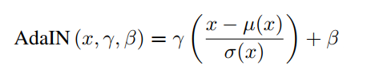
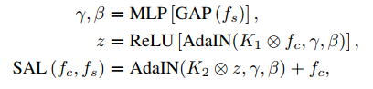
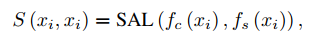
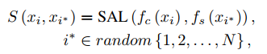
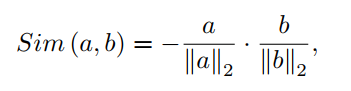
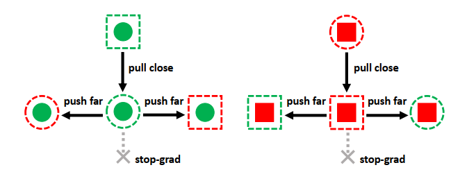
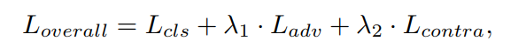

# ĐỒ ÁN: FACE ANTI-SPOOFING DỰA TRÊN SHUFFLED STYLE ASSEMBLY NETWORK (SSAN)

## 1. Giới thiệu

Nhận dạng khuôn mặt là một trong những công nghệ thị giác máy tính được ứng dụng rộng rãi trong các hệ thống xác thực hiện đại như kiểm soát truy cập và thanh toán điện tử. Tuy nhiên, các hệ thống này vẫn dễ bị tấn công bởi các hình thức giả mạo trình diễn như ảnh in, video phát lại hoặc hiển thị trên màn hình, làm phát sinh nhu cầu cấp thiết đối với bài toán Face Anti-Spoofing (FAS).

Các phương pháp FAS hiện nay, đặc biệt là các mô hình học sâu, đã đạt được hiệu quả tốt trong điều kiện huấn luyện và kiểm thử cùng miền dữ liệu. Tuy nhiên, khi áp dụng vào các kịch bản thực tế với sự khác biệt lớn về thiết bị, môi trường và điều kiện thu thập dữ liệu, hiệu năng của mô hình thường suy giảm đáng kể. Nguyên nhân chủ yếu đến từ hiện tượng lệ thuộc tập dữ liệu (dataset bias), khiến mô hình khó tổng quát hóa sang các miền dữ liệu chưa từng xuất hiện trong quá trình huấn luyện.

Mặc dù các phương pháp thích nghi miền yêu cầu dữ liệu miền đích không gán nhãn, điều này khó khả thi trong các hệ thống FAS thực tế. Do đó, hướng tiếp cận tổng quát hóa miền (Domain Generalization) được xem là phù hợp hơn. Tuy nhiên, nhiều phương pháp DG hiện tại chưa khai thác đầy đủ sự khác biệt giữa thống kê toàn cục và cục bộ trong ảnh khuôn mặt.

Dựa trên quan sát rằng Batch Normalization và Instance Normalization tập trung vào các loại thống kê khác nhau, công trình Shuffled Style Assembly Network (SSAN) đề xuất tách biểu diễn đặc trưng thành hai thành phần: content (đặc trưng toàn cục) và style (đặc trưng cục bộ). Thông qua cơ chế tái tổ hợp style và chiến lược học tương phản, SSAN tăng cường các đặc trưng liên quan đến liveness đồng thời hạn chế ảnh hưởng của các yếu tố phụ thuộc miền dữ liệu.

Trong đồ án này, chúng tôi dựa trên ý tưởng của SSAN để xây dựng và đánh giá một mô hình Face Anti-Spoofing trong bối cảnh dữ liệu thu thập từ webcam, đồng thời so sánh hiệu quả của mô hình đề xuất với một mô hình baseline nhằm đánh giá khả năng tổng quát hóa trong môi trường thực tế.

---

## 2. Nghiên cứu liên quan

### Face Anti-Spoofing
Các phương pháp Face Anti-Spoofing truyền thống chủ yếu dựa trên việc trích xuất các đặc trưng thủ công như LBP và SIFT để phân biệt giữa khuôn mặt thật và khuôn mặt giả. Với sự phát triển của học sâu, các mô hình CNN đã được sử dụng để học trực tiếp bộ phân loại nhị phân. Ngoài ra, nhiều nghiên cứu khai thác thông tin phụ trợ như bản đồ độ sâu, bản đồ phản xạ và tín hiệu rPPG nhằm nâng cao hiệu quả phân biệt.

Để cải thiện khả năng tổng quát hóa trong các kịch bản khác miền dữ liệu, các kỹ thuật Domain Adaptation và Domain Generalization đã được đề xuất. Các phương pháp này bao gồm giảm khoảng cách phân phối giữa các miền, học đối kháng và học biểu diễn tách rời. Gần đây, các phương pháp dựa trên meta-learning cũng được phát triển nhằm tăng cường khả năng tổng quát hóa của mô hình.

Khác với các phương pháp DG trước đây, SSAN đề xuất tách biểu diễn đặc trưng thành hai thành phần là content và style với các chiến lược giám sát khác nhau, đồng thời sử dụng học tương phản để tổ chức lại không gian đặc trưng theo hướng tổng quát hơn.

---

### Normalization và Style Transfer
Batch Normalization và Instance Normalization tập trung vào các loại thống kê khác nhau, trong đó BN nhấn mạnh đặc trưng toàn cục còn IN tập trung vào các đặc trưng cục bộ liên quan đến texture. Adaptive Instance Normalization được sử dụng rộng rãi trong các bài toán chuyển phong cách và sinh ảnh. Dựa trên đặc tính này, SSAN áp dụng các lớp dựa trên AdaIN để tái tổ hợp các đặc trưng content và style, từ đó xây dựng một không gian đặc trưng có khả năng tổng quát hóa tốt hơn cho bài toán Face Anti-Spoofing.


## 3. Phương pháp đề xuất

Trong đồ án này, chúng tôi xây dựng mô hình Face Anti-Spoofing dựa trên ý tưởng của Shuffled Style Assembly Network (SSAN), với mục tiêu nâng cao khả năng tổng quát hóa miền (Domain Generalization) trong các kịch bản dữ liệu thực tế. Phương pháp đề xuất tập trung vào việc tách và khai thác hiệu quả hai thành phần đặc trưng khác nhau trong ảnh khuôn mặt: content và style.

---

### 3.1. Tổng quan kiến trúc mô hình

Mô hình đề xuất bao gồm các thành phần chính sau:
- Bộ trích xuất đặc trưng content
- Bộ trích xuất đặc trưng style
- Các lớp Shuffled Style Assembly
- Nhánh phân loại liveness
- Các chiến lược học đối kháng và học tương phản


*Hình 1. Sơ đồ tổng thể kiến trúc mô hình SSAN-based cho Face Anti-Spoofing.*

Hình minh họa thể hiện pipeline tổng quát của mô hình. Kiến trúc tổng thể của mạng SSAN gồm các bước chính sau. Trước tiên, các ảnh RGB đến từ nhiều miền khác nhau được đưa vào bộ sinh đặc trưng để trích xuất các biểu diễn đặc trưng. Tiếp theo, một bộ trích xuất đặc trưng kết hợp với lớp đảo ngược gradient (GRL) được huấn luyện bằng học đối kháng nhằm làm cho đặc trưng nội dung trở nên không phân biệt giữa các miền. Song song với đó, một bộ trích xuất đặc trưng khác được sử dụng để thu thập các đặc trưng đa tỷ lệ, giúp nắm bắt thông tin phong cách từ mức độ thô đến chi tiết. Cuối cùng, nhằm tăng cường và tinh chỉnh thông tin phong cách phục vụ cho bài toán Face Anti-Spoofing, một chuỗi các lớp lắp ráp phong cách (SAL) được thiết kế để tái kết hợp linh hoạt giữa đặc trưng nội dung và đặc trưng phong cách, dưới sự hỗ trợ của chiến lược học tương phản.

---

### 3.2. Tách đặc trưng Content và Style

Một trong những ý tưởng cốt lõi của SSAN là việc tách biểu diễn đặc trưng thành hai thành phần có ý nghĩa khác nhau:

- Content feature: biểu diễn các thông tin toàn cục như hình dạng khuôn mặt, cấu trúc ngữ nghĩa và các thuộc tính vật lý ổn định. Thành phần này được kỳ vọng là không phụ thuộc vào miền dữ liệu.
- Style feature: biểu diễn các thông tin cục bộ như texture, ánh sáng, chất liệu bề mặt, vốn chứa cả thông tin liveness và nhiễu phụ thuộc miền.

Trong mô hình, hai loại đặc trưng này được trích xuất thông qua các chiến lược chuẩn hóa khác nhau:
- Batch Normalization được sử dụng để học content feature.
- Instance Normalization được sử dụng để học style feature.

Cách tách này giúp mô hình xử lý riêng biệt các yếu tố cần tổng quát hóa và các yếu tố liên quan trực tiếp đến việc phân biệt live/spoof.

---

### 3.3. Shuffled Style Assembly

Adaptive Instance Normalization (AdaIN) là một phương pháp chuyển phong cách thích ứng, cho phép kết hợp một đặc trưng nội dung (content) với một đặc trưng phong cách (style) bằng cách điều chỉnh thống kê kênh của content theo style. Trong đó, các tham số scale và shift được sinh ra từ đặc trưng style.



*Công thức (1) – Biểu thức Adaptive Instance Normalization (AdaIN).*

Trong mô hình đề xuất, để kết hợp đặc trưng content \( f_c \) và đặc trưng style \( f_s \), các Style Assembly Layers (SAL) được xây dựng dựa trên AdaIN kết hợp với các lớp tích chập và kết nối dư (residual connection). Cụ thể, đặc trưng style được đưa qua phép pooling toàn cục và một mạng MLP để sinh ra các tham số affine, sau đó được sử dụng để chuẩn hóa và điều chỉnh đặc trưng content.



*Công thức (2) – Biểu thức Style Assembly Layer (SAL).*

Tuy nhiên, đặc trưng style không chỉ chứa thông tin liên quan đến liveness mà còn bao gồm các yếu tố phụ thuộc miền dữ liệu, có thể gây lệch miền trong quá trình huấn luyện. Để giảm ảnh hưởng của các yếu tố này và tăng cường khả năng tổng quát hóa, phương pháp Shuffled Style Assembly được đề xuất.

Với một mini-batch gồm N mẫu, mỗi mẫu \( x_i \) được trích xuất thành cặp đặc trưng content \( f_c(x_i) \) và style \( f_s(x_i) \). Khi kết hợp content và style từ cùng một mẫu, ta thu được đặc trưng:



*Công thức (3) – Self-assembly feature \( S(x_i; x_i) \).*

Đặc trưng này được gọi là self-assembly feature, đại diện cho việc tái tổ hợp style và content gốc của chính mẫu đó.

Ngoài ra, để khai thác hiệu quả các đặc trưng style liên quan đến liveness, mô hình tạo ra các đặc trưng phụ trợ bằng cách xáo trộn (shuffle) các cặp content và style trong cùng mini-batch. Cụ thể, content của mẫu \( x_i \) được kết hợp với style của một mẫu ngẫu nhiên khác \( x_{i^*} \):



*Công thức (4) – Shuffle-assembly feature \( S(x_i; x_{i^*}) \).*

Các đặc trưng này được gọi là shuffle-assembly features. Việc tạo ra self-assembly và shuffle-assembly features giúp mô hình quan sát được nhiều tổ hợp content–style khác nhau, từ đó tăng tính đa dạng của không gian đặc trưng và hỗ trợ học tổng quát hóa miền.


---

### 3.4. Học tương phản cho đặc trưng Style

Trong các kịch bản khác miền dữ liệu, một thách thức lớn của đặc trưng style là các yếu tố phụ thuộc miền có thể che lấp các thông tin liên quan đến liveness, dẫn đến sai sót trong quá trình phân loại. Để khắc phục vấn đề này, mô hình đề xuất áp dụng một chiến lược học tương phản nhằm nhấn mạnh các đặc trưng style liên quan đến liveness và đồng thời làm suy giảm các đặc trưng phụ thuộc miền.

Sau khi kết hợp đặc trưng content và style, mô hình tạo ra hai loại đặc trưng:
- Self-assembly feature: S(xᵢ; xᵢ), trong đó content và style được lấy từ cùng một ảnh.
- Shuffle-assembly feature: S(xᵢ; xᵢ*), trong đó content của ảnh hiện tại được kết hợp với style của ảnh khác trong cùng batch.

Đặc trưng self-assembly được đưa trực tiếp vào bộ phân loại và được giám sát bằng hàm mất mát phân loại nhị phân L_cls. Trong khi đó, các đặc trưng shuffle-assembly được so sánh với đặc trưng self-assembly tương ứng bằng độ đo cosine similarity.



*Công thức (1) – Độ tương đồng cosine giữa hai vector đặc trưng.*

Cosine similarity được sử dụng để đo mức độ giống nhau giữa hai vector đặc trưng đã được chuẩn hóa L2, và có thể được xem là tương đương với sai số bình phương trung bình giữa các vector đã chuẩn hóa.

Trong không gian đặc trưng style, các đặc trưng self-assembly được xem như các anchor. Một phép toán stop-gradient được áp dụng lên các anchor này nhằm cố định vị trí của chúng trong quá trình huấn luyện. Các đặc trưng shuffle-assembly sau đó được kéo lại gần hoặc đẩy ra xa khỏi anchor tương ứng, tùy thuộc vào việc chúng có cùng nhãn liveness hay không.



*Hình 3. Minh họa cơ chế contrastive learning cho đặc trưng style, trong đó self-assembly đóng vai trò anchor và shuffle-assembly được điều chỉnh dựa trên thông tin liveness.*

Cụ thể, nếu hai mẫu có cùng nhãn liveness, các đặc trưng shuffle-assembly sẽ được kéo gần anchor; ngược lại, nếu khác nhãn, chúng sẽ bị đẩy ra xa. Trong quá trình này, gradient chỉ được lan truyền qua các đặc trưng shuffle-assembly, giúp tập trung học các thông tin style liên quan đến liveness.

Hàm mất mát học tương phản được xây dựng dựa trên mức độ tương đồng cosine và tính nhất quán của nhãn liveness giữa hai mẫu.


*Công thức (2) – Hàm mất mát contrastive cho đặc trưng style.*

Thông qua cơ chế học tương phản này, mô hình có thể làm nổi bật các đặc trưng style liên quan đến liveness trong khi hạn chế ảnh hưởng của các yếu tố phụ thuộc miền, từ đó cải thiện khả năng tổng quát hóa trong bài toán Face Anti-Spoofing.


---

### 3.5. Học đối kháng cho đặc trưng Content

Đối với đặc trưng content, mô hình áp dụng adversarial learning nhằm loại bỏ thông tin phụ thuộc miền dữ liệu. Một bộ phân biệt miền được sử dụng để dự đoán domain từ content feature, trong khi bộ trích xuất content được huấn luyện để đánh lừa bộ phân biệt này.

Thông qua quá trình huấn luyện đối kháng, content feature trở nên bất biến hơn đối với sự thay đổi miền dữ liệu, từ đó cải thiện khả năng tổng quát hóa của mô hình.

---

### 3.6. Hàm mất mát tổng

Mô hình được huấn luyện theo chiến lược đa nhiệm với tổng hàm mất mát:



*Tổng hàm mất mát của mô hình.*

Trong đó:
- Hàm mất mát phân loại liveness đảm bảo khả năng phân biệt live/spoof.
- Hàm mất mát đối kháng giúp content không chứa thông tin miền.
- Hàm mất mát tương phản tăng cường các đặc trưng style liên quan đến liveness.

Việc kết hợp các thành phần mất mát này cho phép mô hình học được một không gian đặc trưng vừa có khả năng phân biệt tốt, vừa có tính tổng quát cao trong các kịch bản Face Anti-Spoofing thực tế.

---

### 3.7. Tóm tắt phương pháp

Phương pháp đề xuất dựa trên SSAN tận dụng sự khác biệt giữa content và style để xây dựng một mô hình Face Anti-Spoofing có khả năng tổng quát hóa tốt hơn. Thông qua cơ chế Shuffled Style Assembly, học tương phản và học đối kháng, mô hình có thể khai thác hiệu quả các đặc trưng liên quan đến liveness trong khi giảm thiểu ảnh hưởng của sự thay đổi miền dữ liệu.

## 4. Mô tả bộ dữ liệu

### 4.1. Tổng quan bộ dữ liệu

Trong đồ án này, chúng tôi xây dựng và sử dụng một bộ dữ liệu Face Anti-Spoofing tổng hợp từ nhiều nguồn khác nhau nhằm mô phỏng các kịch bản dữ liệu đa miền (multi-domain) trong thực tế. Bộ dữ liệu bao gồm cả dữ liệu công khai và dữ liệu tự thu thập, với sự đa dạng về thiết bị, môi trường, điều kiện ánh sáng và hình thức tấn công giả mạo.

Mục tiêu của việc kết hợp nhiều nguồn dữ liệu là đánh giá khả năng tổng quát hóa miền (Domain Generalization) của các mô hình Face Anti-Spoofing trong các kịch bản gần với ứng dụng thực tế.

---

### 4.2. Cấu trúc thư mục dữ liệu

Sau khi tiền xử lý, bộ dữ liệu được tổ chức theo cấu trúc sau:

```
dataset_processed/
    ├── CUSTOM/
    ├── CUSTOM2/
    ├── CUSTOM3/
    ├── MSU_MFSD/
    ├── SiW/
    ├── WEBCAM/
    ├── CUSTOM_list.csv
    ├── CUSTOM2_list.csv
    ├── CUSTOM3_list.csv
    ├── MSU_MFSD_list.csv
    ├── SiW_list.csv
    ├── WEBCAM_list.csv
    ├── list_filtered.csv
```
Trong đó:
- Mỗi thư mục con (`CUSTOM`, `CUSTOM2`, `CUSTOM3`, `MSU_MFSD`, `SiW`, `WEBCAM`) tương ứng với một domain dữ liệu độc lập.
- Mỗi domain bao gồm hai thư mục con:
  - `live`: chứa ảnh khuôn mặt thật
  - `not_live`: chứa ảnh khuôn mặt giả

---

### 4.3. Nguồn dữ liệu và đặc điểm từng domain

- MSU_MFSD:  
  Bộ dữ liệu công khai, bao gồm các hình thức tấn công phổ biến như ảnh in và video replay, được thu thập trong điều kiện phòng thí nghiệm.

- SiW:  
  Bộ dữ liệu công khai với nhiều loại tấn công và điều kiện thu thập khác nhau, thường được sử dụng trong các nghiên cứu Face Anti-Spoofing và Domain Generalization.

- WEBCAM:  
  Bộ dữ liệu tự thu thập, trong đó các video spoof được quay bằng điện thoại và phát lại trước webcam máy tính xách tay. Domain này mô phỏng sát các kịch bản giả mạo trong môi trường thực tế.

- CUSTOM, CUSTOM2, CUSTOM3:  
  Các bộ dữ liệu tự xây dựng với sự khác biệt về thiết bị, điều kiện ánh sáng, độ phân giải và môi trường ghi hình, nhằm tăng độ đa dạng domain và kiểm tra khả năng tổng quát hóa của mô hình.

Việc kết hợp các domain tự thu thập và domain công khai giúp bộ dữ liệu bao phủ nhiều phân phối dữ liệu khác nhau, từ đó tạo điều kiện thuận lợi cho việc đánh giá các phương pháp Face Anti-Spoofing trong bối cảnh đa miền.

---

### 4.4. Định dạng dữ liệu và nhãn

Mỗi domain đi kèm một file CSV mô tả danh sách ảnh, trong đó mỗi dòng tương ứng với một mẫu dữ liệu. Các file CSV có cấu trúc thống nhất gồm các cột:

- `path`: đường dẫn tương đối tới ảnh
- `label`: nhãn phân loại (1: live, 0: not_live)
- `domain`: tên domain dữ liệu

Ngoài ra, file `list_filtered.csv` được sử dụng để tổng hợp và lọc dữ liệu từ tất cả các domain, phục vụ cho quá trình huấn luyện và đánh giá mô hình.

---

### 4.5. Tiền xử lý dữ liệu

Trước khi đưa vào huấn luyện, dữ liệu được tiền xử lý theo các bước sau:
- Trích xuất khuôn mặt từ ảnh/video gốc
- Căn chỉnh và crop khuôn mặt
- Resize ảnh về kích thước 256 × 256
- Chuẩn hóa ảnh về không gian RGB

Các bước tiền xử lý này giúp đảm bảo tính nhất quán của dữ liệu đầu vào giữa các domain khác nhau.

---

### 4.6. Phân chia tập dữ liệu

Dữ liệu được chia thành hai tập, sử dụng cho cả baseline và SSAN:
- Tập huấn luyện (Train): 33,935 ảnh (80%)
- Tập kiểm thử (Test): 8,487 ảnh (20%)
- Tổng cộng: 42,422 ảnh
Việc chia dữ liệu được thực hiện sao cho các domain được phân bố hợp lý giữa các tập, nhằm đánh giá khả năng tổng quát hóa của mô hình trong các kịch bản khác miền.

---

### 4.7. Ý nghĩa của bộ dữ liệu trong đồ án

Bộ dữ liệu đa miền được xây dựng trong đồ án cho phép:
- Đánh giá mô hình Face Anti-Spoofing trong điều kiện gần với thực tế
- Phân tích khả năng tổng quát hóa miền của các mô hình
- So sánh công bằng giữa mô hình baseline và mô hình đề xuất dựa trên SSAN

Nhờ sự đa dạng về nguồn dữ liệu và hình thức tấn công, bộ dữ liệu đóng vai trò quan trọng trong việc kiểm chứng hiệu quả của phương pháp đề xuất.

---

## 5. Mô hình Baseline

Để đánh giá hiệu quả của mô hình đề xuất dựa trên SSAN, đồ án xây dựng một mô hình baseline đơn giản dựa trên mạng nơ-ron tích chập (CNN). Mô hình baseline được thiết kế với kiến trúc nhẹ, không sử dụng các cơ chế tổng quát hóa miền hay học đặc trưng nâng cao, nhằm phản ánh hiệu năng của một phương pháp Face Anti-Spoofing truyền thống dựa trên học sâu.

Mô hình này đóng vai trò là mốc so sánh để đánh giá mức độ cải thiện của mô hình chính trong các kịch bản dữ liệu thực tế.

---

### 5.1. Kiến trúc mô hình

Mô hình baseline sử dụng kiến trúc CNN đơn giản gồm hai khối tích chập và hai lớp kết nối đầy đủ. Cấu trúc cụ thể như sau:

- Lớp tích chập thứ nhất:  
  - Số kênh đầu vào: 3 (ảnh RGB)  
  - Số kênh đầu ra: 32  
  - Kích thước kernel: 3 × 3  
  - Padding: 1  
  - Hàm kích hoạt: ReLU  

- Lớp gộp cực đại (Max Pooling):  
  - Kích thước kernel: 2 × 2  

- Lớp tích chập thứ hai:  
  - Số kênh đầu vào: 32  
  - Số kênh đầu ra: 64  
  - Kích thước kernel: 3 × 3  
  - Padding: 1  
  - Hàm kích hoạt: ReLU  

- Lớp gộp cực đại (Max Pooling):  
  - Kích thước kernel: 2 × 2  

Sau hai lần pooling, đặc trưng không gian được giảm kích thước và được làm phẳng để đưa vào các lớp kết nối đầy đủ:
- Lớp Fully Connected 1: 128 nút, ReLU
- Lớp Fully Connected 2: 2 nút đầu ra, tương ứng với hai lớp live và not_live

---

### 5.2. Dữ liệu và tiền xử lý

Ảnh đầu vào được chuyển về không gian RGB và áp dụng các bước tiền xử lý và tăng cường dữ liệu như sau:
- Resize ảnh về kích thước 256 × 256
- Lật ảnh theo chiều ngang ngẫu nhiên
- Điều chỉnh độ sáng và độ tương phản
- Chuẩn hóa ảnh với mean = [0.5, 0.5, 0.5] và standard deviation = [0.5, 0.5, 0.5]

Các bước tiền xử lý này giúp tăng tính đa dạng của dữ liệu huấn luyện và cải thiện khả năng học của mô hình baseline.

---

### 5.3. Thiết lập huấn luyện

Mô hình baseline được huấn luyện theo phương pháp học có giám sát với các thiết lập sau:
- Hàm mất mát: Cross-Entropy Loss
- Optimizer: Adam
- Learning rate ban đầu: 3 × 10⁻⁴
- Weight decay: 1 × 10⁻⁵
- Batch size: 64
- Số epoch tối đa: 60

Để cải thiện quá trình hội tụ, chiến lược điều chỉnh learning rate được áp dụng thông qua ReduceLROnPlateau, trong đó learning rate được giảm khi chỉ số đánh giá không được cải thiện sau một số epoch liên tiếp.

Ngoài ra, mô hình sử dụng Early Stopping dựa trên chỉ số đánh giá chính nhằm tránh overfitting và tiết kiệm thời gian huấn luyện.

---

### 5.4. Chỉ số đánh giá

Để đảm bảo so sánh công bằng với mô hình chính, mô hình baseline được đánh giá bằng các chỉ số chuẩn trong Face Anti-Spoofing, bao gồm:
- Accuracy (ACC)
- Area Under Curve (AUC)
- Half Total Error Rate (HTER)
- False Positive Rate (FPR)
- False Rejection Rate (FRR)

Trong đó, chỉ số chính được sử dụng để lựa chọn mô hình tốt nhất và điều khiển quá trình huấn luyện là:

Metric = AUC − HTER

---

### 5.5. Chiến lược huấn luyện và chọn mô hình

Trong mỗi epoch, mô hình baseline được huấn luyện trên tập train và đánh giá trên tập validation. Giá trị AUC − HTER được sử dụng để:
- Lưu mô hình tốt nhất (best model)
- Điều chỉnh learning rate
- Kích hoạt cơ chế early stopping khi metric không được cải thiện sau một số epoch liên tiếp

Chiến lược này đảm bảo mô hình baseline được huấn luyện và đánh giá dưới cùng một tiêu chí với mô hình chính, từ đó cho phép so sánh công bằng về hiệu năng.

---

### 5.6. Vai trò của mô hình Baseline

Mô hình baseline CNN phản ánh hiệu năng của một phương pháp Face Anti-Spoofing dựa trên học sâu truyền thống, không sử dụng các chiến lược tổng quát hóa miền. Do đó, mô hình này được sử dụng làm mốc tham chiếu để:
- Đánh giá mức độ cải thiện của mô hình SSAN-based
- Phân tích tác động của các cơ chế Shuffled Style Assembly, học tương phản và học đối kháng
- Làm rõ ưu điểm của phương pháp đề xuất trong các kịch bản dữ liệu thực tế và khác miền

---

## 6. Kết quả thực nghiệm SSAN

### 6.1. Chi tiết cài đặt (Implementation Details)

Trong đồ án này, mô hình chính được xây dựng dựa trên kiến trúc SSAN-based, kế thừa ý tưởng từ bài báo *Shuffled Style Assembly Network (SSAN)* cho bài toán Face Anti-Spoofing trong điều kiện đa miền (multi-domain).

#### Môi trường huấn luyện
- Nền tảng: Kaggle
- GPU: 2 × NVIDIA Tesla T4 (16GB VRAM), sử dụng `DataParallel`
- Framework: PyTorch
- Hệ điều hành: Linux (Kaggle Runtime)

#### Tiền xử lý và tăng cường dữ liệu
- Kích thước ảnh đầu vào: 256 × 256
- Chuẩn hóa ảnh:
  \[
  x' = \frac{x - 127.5}{128}
  \]
- Tăng cường dữ liệu (chỉ áp dụng cho tập train):
  - Random Horizontal Flip
  - Random Rotation (±10°)
  - Random Brightness & Contrast
  - Gaussian Blur
  - Cutout
- Không áp dụng augmentation cho tập validation

#### Thiết lập huấn luyện
- Batch size: 16
- Số epoch tối đa: 120
- Optimizer: Adam
  - Learning rate ban đầu: 5 × 10⁻⁵
  - Weight decay: 1 × 10⁻⁴
- Scheduler: CosineAnnealingLR
  - Learning rate tối thiểu: 1 × 10⁻⁶
- Early stopping:
  - Patience = 20 epochs
  - Theo dõi chỉ số AUC − HTER

---

### 6.2. Kết quả thực nghiệm của mô hình chính

#### Chỉ số đánh giá
Mô hình được đánh giá bằng các chỉ số chuẩn trong Face Anti-Spoofing:
- ACC (Accuracy)
- AUC (Area Under ROC Curve)
- HTER (Half Total Error Rate)
- FPR (False Positive Rate)
- FRR (False Rejection Rate)

Chỉ số chính được sử dụng để chọn mô hình tốt nhất là:
\[
\text{Metric} = \text{AUC} - \text{HTER}
\]

Metric này giúp cân bằng giữa khả năng phân biệt và mức độ ổn định của mô hình trong các kịch bản spoofing thực tế.

---

#### Kết quả định lượng
Mô hình SSAN-based đạt được kết quả tích cực trên tập validation đa miền:
- Giá trị AUC cao, cho thấy khả năng phân biệt live/spoof hiệu quả
- HTER thấp, phản ánh tỷ lệ lỗi tổng hợp được kiểm soát tốt
- Accuracy ổn định trong suốt quá trình huấn luyện
- Quá trình huấn luyện hội tụ mượt, không xảy ra overfitting rõ rệt nhờ early stopping

*Tại đây có thể chèn:*
- Biểu đồ training/validation loss
- Biểu đồ AUC và HTER theo epoch
- Bảng kết quả tại epoch tốt nhất

---

#### Đánh giá định tính
Ngoài đánh giá offline, mô hình còn được kiểm thử trong kịch bản thời gian thực (real-time) với webcam:
- Hoạt động ổn định trong điều kiện ánh sáng yếu
- Chịu được nhiễu từ webcam chất lượng thấp
- Nhận diện được nhiều khuôn mặt đồng thời
- Tốc độ suy luận (inference) đáp ứng yêu cầu triển khai thực tế

---

## 7. So sánh SSAN với mô hình baseline

So với mô hình CNN baseline:
- Mô hình SSAN-based đạt AUC cao hơn đáng kể
- HTER giảm rõ rệt, đặc biệt trong các kịch bản khác miền
- Ít bị ảnh hưởng bởi domain shift
- Quá trình huấn luyện ổn định và hội tụ tốt hơn

Những kết quả này cho thấy việc kết hợp Shuffled Style Assembly, Contrastive Learning và Adversarial Learning giúp cải thiện đáng kể khả năng tổng quát hóa của mô hình Face Anti-Spoofing trong môi trường thực tế.
